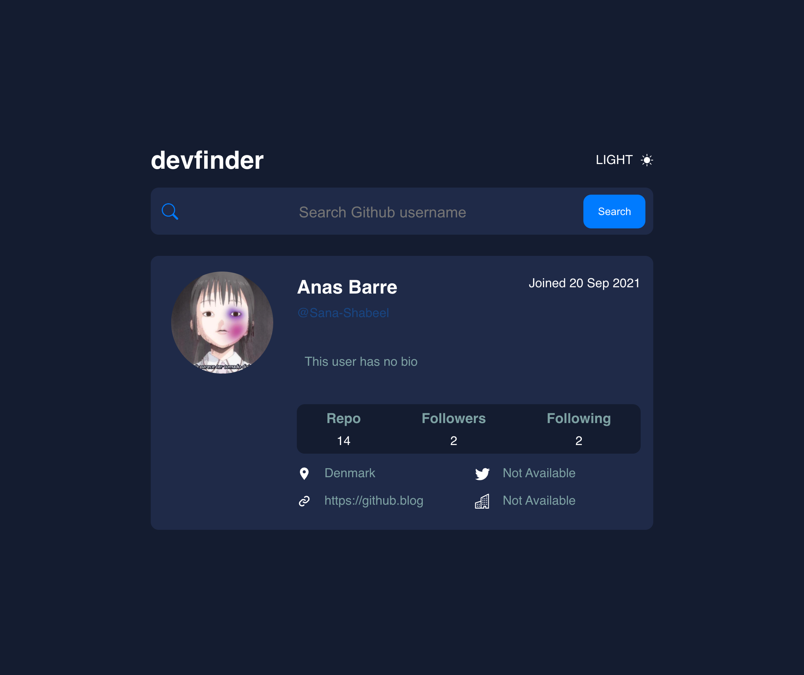

# Devfinder react

Frontend Mentor challenge: Devfinder

## The challenge

- View the optimal layout for the app depending on their device's screen size

- See hover states for all interactive elements on the page

- Search for GitHub users by their username

- See relevant user information based on their search

## Screenshot

## links

- Live Site URl:

# My process

## Built with

- React
- React Moment
- React Context
- Github Api
- CSS Grid
- CSS Flexbox

## What I learned

- React Moment
- React Context
- React APi
- CSS styling in React
- CSS styles in JavaScript
- Responsive webpages

## Author

- Anas Barre - [@Anas-Barre](sanastrobarre99@gmail.com)
